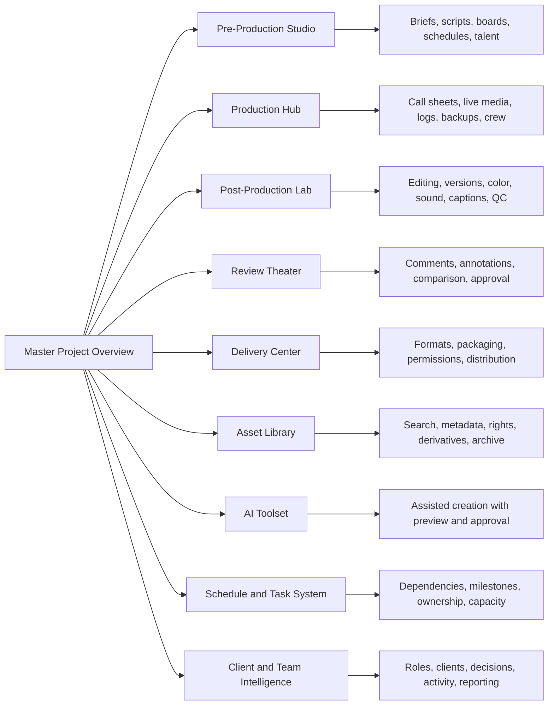

# Co-ProVideo

## The master surface and everything beneath it

Co-ProVideo is a connected creative-production operating world. The master overview is not a decorative dashboard and no visible label is a dead end. Every title, stage, status, thumbnail, tool, task, person, date, icon, and action opens a deeper working surface with its own decisions, options, history, and outputs.

The master remains clean because it shows the truth of the system without exposing every child control at once. Richness lives beneath clear doorways. The overview answers what is happening now. Deeper studios answer how the work is shaped, changed, approved, delivered, and understood.

## Master-surface rule

Every parent surface follows the same four-layer rhythm:

1. **Signal** — the master shows the current truth: state, owner, progress, deadline, risk, or next action.
2. **Preview** — a concise visual summary shows the most important work without flooding the page.
3. **Doorway** — a specific action names the deeper destination: Open Review Theater, Open Production Hub, Open Asset Library.
4. **Studio** — the child surface contains the complete toolset, optionality, history, permissions, and outputs.

No generic “View all.” No ambiguous arrow. No repeated summary with nowhere deeper to go.

## Global parent shell

| Visible truth | Deeper surface | Toolsets and optionality | Result |
|---|---|---|---|
| Co-ProVideo logo | Studio Home | Workspace switcher, client portals, active projects, recent work, studio health | A clear return to the operating center |
| Search | Universal Search | Projects, media, people, comments, transcripts, timecodes, tasks, briefs, filenames, tags, decisions | One searchable creative memory |
| Upload | Ingest Studio | Video, audio, images, briefs, brand files, folder upload, resumable transfer, proxy creation, metadata, duplicate detection, technical validation | Organized media ready for production |
| Share | Secure Sharing Studio | Client portal, review link, asset collection, password, expiration, watermark, download rules, recipient roles | Controlled collaboration outside the studio |
| Notifications | Attention Center | Review requests, approvals, mentions, deadlines, upload completion, failed exports, delivery confirmation | Calm, prioritized attention |
| Profile | Identity and Workspace | Role, permissions, notification preferences, workspace switching, client identity, accessibility | Personal control without clutter |

## Overview

The Overview is the master narrative of one project. It shows the project identity, active version, current production stage, immediate client need, latest media, recent decisions, schedule movement, key assets, and project health.

It opens into every specialized studio without trying to become those studios. It should answer five questions immediately:

- What is this project?
- Where is it now?
- What needs attention?
- What happens next?
- Where does deeper work happen?

## Projects

The Projects surface becomes the complete portfolio of work: leads, active productions, retained relationships, paused engagements, delivered campaigns, and archived projects.

Deeper options include project templates, duplicate-from-template, project health, producer ownership, client identity, delivery date, budget sensitivity, stage filtering, workload filtering, saved views, portfolio grouping, campaign families, project archiving, and secure client access.

Each project opens its own connected world rather than a generic detail page.

## Media Library

The Media Library becomes the source-media intelligence layer.

It supports original camera media, proxies, audio, stills, graphics, documents, selects, transcripts, captions, project associations, campaign associations, people, locations, products, scenes, usage rights, expiration dates, technical metadata, codecs, dimensions, frame rates, durations, checksums, duplicates, and archival state.

Search can reach spoken words inside transcripts, visual tags, filenames, comments, timecodes, and project notes. A selected media item opens a detailed media surface with preview, metadata, usage history, related edits, rights, derivatives, and download controls.

## Sequences

Sequences becomes the structural storytelling studio.

It contains assemblies, selects reels, story sequences, social variations, chapter maps, script alignment, timecoded transcripts, scene order, pacing notes, alternate openings, alternate endings, vertical adaptations, platform versions, and version ancestry.

A sequence can open into an editorial timeline, a review version, a delivery format, or an AI-assisted rearrangement preview.

## Boards

Boards becomes the visual-direction environment.

It includes creative boards, moodboards, storyboards, shot boards, location boards, talent boards, wardrobe boards, color references, lighting references, composition references, motion references, campaign references, brand guardrails, and client-approved visual direction.

Every board supports comments, pinning, ordering, comparison, presentation mode, client visibility, internal notes, and approval history.

## Reviews

Reviews becomes the full Review Theater.

The theater includes frame-accurate comments, timestamped conversations, drawing and annotation, comment categories, internal notes, client-visible notes, attachments, mentions, reactions, resolved states, duplicate detection, version comparison, split-screen comparison, overlay comparison, review deadlines, watermarking, captions, transcript navigation, chapter markers, consolidated feedback, and final approval.

Approval can contain multiple stages: Client Reviewer, Client Owner, Producer, Legal, Brand, Content Co-op Producer, or custom roles. Every approval records version, approver, timestamp, note, and audit history.

## Tasks

Tasks becomes the work-orchestration system.

Each task can contain an owner, collaborators, due date, priority, status, description, checklist, dependency, blocker, attachment, comment thread, related media, related review note, related deliverable, estimate, time record, recurring rule, approval gate, and automation.

Task views include My Work, Team Work, Project Work, Review Work, Shoot-Day Work, Editorial Queue, Blocked Work, Due Soon, and Completed Work.

## AI Tools

AI Tools becomes a controlled creative-assistance studio. Every AI action begins with project context, shows a preview, preserves the source, names the change, and requires human acceptance before affecting approved work.

### Auto Rough Cut

Transcript-led assembly, silence trimming, duplicate-take reduction, scene grouping, quote selection, pacing presets, story length targets, platform targets, and protected must-keep moments.

### Smart Scene Select

Best-take ranking, focus quality, exposure quality, stability, facial expression, performance strength, product visibility, continuity, camera angle, and client-favorite preservation.

### Auto Captions

Transcription, speaker identification, punctuation, line breaking, caption-safe placement, brand caption styles, emphasis words, multilingual versions, subtitle files, and accessibility checks.

### B-Roll Suggest

Transcript-aware visual suggestions, asset-library matches, missing-coverage detection, shot recommendations, product cutaways, location cutaways, emotional support imagery, and rights-aware source filtering.

### Voice Enhancement

Noise reduction, hum removal, room-tone balancing, click removal, level balancing, clarity enhancement, breath sensitivity, speaker consistency, and before-and-after comparison.

### Look Match

Brand color references, camera matching, scene continuity, exposure alignment, contrast character, skin-tone protection, product-color protection, reference-frame comparison, and reusable visual presets.

### AI Copilot

The Copilot becomes the conversational doorway across the project. It can answer project questions, locate media, summarize feedback, identify blockers, draft a shot list, prepare a review summary, recommend the next action, surface missing approvals, suggest versions, and create proposed artifacts.

It never silently publishes, approves, sends, invoices, or overwrites. External actions remain explicit and approval-gated.

## Assets

Assets becomes the active creative collection layer.

It contains project files, working graphics, approved graphics, logos, brand kits, music, sound effects, fonts, motion templates, thumbnails, transcripts, caption files, release forms, contracts, and reference documents.

Asset detail includes source, owner, project, campaign, version, rights, allowed use, expiration, related derivatives, usage history, favorites, collections, and secure download.

## Team

Team becomes the people-and-capacity surface.

It includes producers, editors, shooters, designers, motion artists, audio specialists, account leads, freelancers, vendors, client owners, client reviewers, legal reviewers, and viewers.

Each person has role, project access, current workload, specialty, availability, recent activity, assigned tasks, approval authority, and communication preferences.

## Activity

Activity becomes the project’s trustworthy memory.

It records uploads, comments, decisions, task changes, version creation, review requests, approvals, asset delivery, permission changes, schedule changes, exports, downloads, and external sharing.

Filters separate client-visible activity, internal activity, comments, tasks, reviews, decisions, deliveries, and system events. Important decisions can be promoted into a permanent decision log.

## Deliverables

Deliverables becomes the final-output system.

Every deliverable includes title, purpose, audience, platform, aspect ratio, resolution, duration, codec, audio specification, caption requirement, thumbnail requirement, language, version, owner, due date, approval status, QC state, delivery destination, and rights sensitivity.

Deliverable families support master film, web film, vertical edit, square edit, social cutdown, teaser, trailer, clean version, captioned version, audio-only version, transcript, thumbnail package, and campaign bundle.

## Settings

Settings becomes the controlled project and workspace configuration layer.

It includes project identity, client branding, portal appearance, roles, permissions, review rules, approval stages, notification preferences, delivery presets, naming conventions, retention rules, watermark rules, integrations, security, audit history, and template inheritance.

## Project shortcuts

### Creative Brief

Objective, audience, problem, message, emotional tone, call to action, brand guardrails, deliverables, platforms, references, stakeholders, constraints, success measures, and approval history.

### Brand Guidelines

Logo use, typography, color, imagery, motion, sound, tone of voice, products, people, prohibited treatments, legal requirements, and approved examples.

### AI Style Presets

Caption style, color character, pacing preference, transition restraint, framing preference, copy tone, thumbnail treatment, voice cleanup, and platform adaptation rules.

### Voice Library

Approved voices, speaker profiles, pronunciations, language, tone, usage rights, recording references, processed samples, and project usage history.

## Hero media player

The player is the central creative object. Its quiet default state opens into deeper media control:

- Frame-accurate timecode.
- Comments and markers.
- Chapters and scene boundaries.
- Captions and transcript.
- Annotation tools.
- Version selection.
- Side-by-side comparison.
- Overlay comparison.
- Playback speed.
- Audio channels.
- Quality selection.
- Safe-zone overlays.
- Download rules.
- Watermark rules.
- Full-screen Review Theater.

## Review and Approval

The master shows the current approval step. The deeper surface reveals approval sequence, approvers, due dates, reminders, review notes, outstanding questions, consolidated feedback, version history, legal status, brand status, final lock, and audit history.

“Submit Feedback” opens the feedback workflow. “Approve v5” confirms the exact version. “Open Review Theater” opens the complete review environment.

## Pre-Production Studio

The Pre-Production Studio contains:

- Project brief.
- Creative direction.
- Script development.
- Storyboards.
- Shot lists.
- Production schedule.
- Call sheets.
- Locations.
- Talent and casting.
- Wardrobe and props.
- Crew planning.
- Equipment planning.
- Releases.
- Insurance.
- Travel and logistics.
- Weather awareness.
- Budget checkpoints.
- Risk and contingency plans.
- Client approvals.
- Readiness score.

## Production Hub

The Production Hub contains:

- Shoot-day command view.
- Call times.
- Crew presence.
- Talent status.
- Location details.
- Scene and shot progress.
- Slate and take logs.
- Camera and audio notes.
- On-set uploads.
- Proxy generation.
- Dailies.
- Select flags.
- Metadata logging.
- Backup verification.
- Incident notes.
- Client monitor notes.
- Team communication.
- Schedule drift.
- Coverage gaps.
- Wrap confirmation.

## Post-Production Lab

The Post-Production Lab contains:

- Editorial queue.
- Editor handoff.
- Source organization.
- Transcript and selects.
- Rough cut.
- Fine cut.
- Picture lock.
- Version history.
- Review notes.
- Motion graphics.
- Titles and lower thirds.
- Color correction.
- Color grade.
- Sound edit.
- Sound mix.
- Music and licensing.
- Voice enhancement.
- Captions and subtitles.
- Accessibility checks.
- Quality control.
- Final approval readiness.

## Delivery Center

The Delivery Center contains:

- Deliverable matrix.
- Export presets.
- Master files.
- Platform versions.
- Captioned versions.
- Clean versions.
- Thumbnails.
- Transcripts.
- Audio deliverables.
- Campaign packages.
- File naming.
- Technical QC.
- Rights validation.
- Secure links.
- Passwords and expiration.
- Recipient permissions.
- Publishing destinations.
- Delivery confirmation.
- Archive policy.
- Performance connection.

## Project Timeline

The master shows the campaign rhythm. The Full Schedule opens milestone detail, task dependencies, owners, deadlines, drag-and-drop planning, calendar synchronization, baseline versus actual timing, critical path, conflicts, review windows, shoot dates, delivery dates, launch dates, and schedule-change history.

## My Tasks

The master shows immediate work. The Task Board opens assignments, dependencies, checklists, priority, effort, time, attachments, comments, related review notes, related assets, blocked reasons, automation, and completion evidence.

## Project Information

The compact master summary opens a complete project record containing client, project owner, account lead, producer, creative lead, budget, scope, contract, start date, target delivery, campaign launch, status, health, risk, stakeholders, portal settings, related projects, and relationship history.

## Optional expansion surfaces

The same architecture can extend into:

- Client Home.
- Client Request Center.
- Campaign Reporting.
- Content Performance.
- CRM and Client Intelligence.
- Studio Command Center.
- Capacity Planning.
- Finance and Profitability.
- Vendor and Freelancer Management.
- Template Library.
- Brand Portal.
- Mobile Review.
- Shoot-Day Mobile Companion.
- Publishing and Distribution.
- Rights and Usage Management.
- Archive and Retention.
- Integrations and Automation.

## Final behavioral principle

Every doorway preserves context. Opening a deeper studio keeps the project, version, media, client, stage, and user role attached. Returning to the master preserves the user’s position. Every change creates visible history. Every external action is deliberate. Every client-facing moment is calm. Every operational surface remains connected to the creative work.

The master is the map. The deeper studios are the territory.
