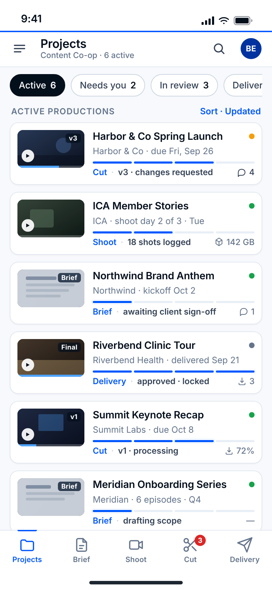
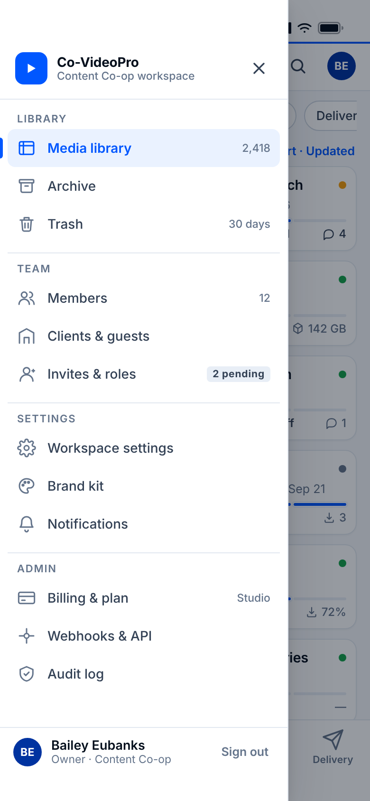
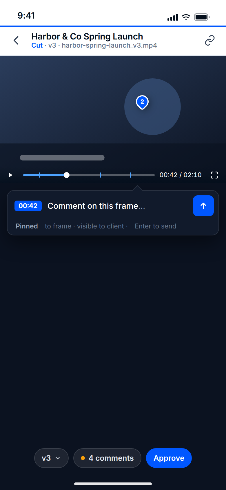
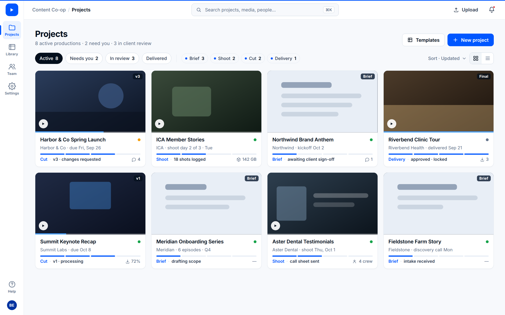
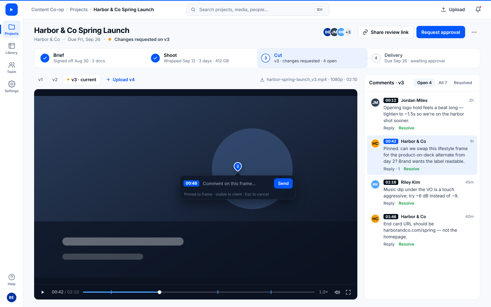

# FABLE — Co-VideoPro navigation mocks (phone + desktop)

**Design comp only.** Nothing in this folder is imported by the app. The live
shell, player, auth, and review UI are untouched.

Chrome is the quiet sapphire CVP language from `app/brand-tokens.css`
(sapphire `#0057FF`, ink `#040F1C`, canvas `#F7F9FC`, 12/8 radii, Inter),
copied inline so every mock is self-contained. Same IA on both form factors:
**Login → Projects**, pipeline **Brief → Shoot → Cut → Delivery**, deep tools
(Library / Team / Settings / Admin) one step away.

## Phone · 390 × 844

| State | Screenshot |
| --- | --- |
| **A — Default.** After login → Projects home. Thin bottom rail only. | `screenshots/a-default-projects-bottom-rail.png` |
| **B — Drawer open.** ☰ / More → Claude Code–style slide-in left drawer. | `screenshots/b-drawer-open-deep-tools.png` |
| **C — Film route.** Opened from Cut or a card's frame. No rail, no app bar, no permanent comment feed. Tap the film → one dialog at the playhead; comments are markers; the list is a sheet on demand. | `screenshots/c-film-route-no-rail.png` |

<p>
  
  &nbsp;
  
  &nbsp;
  
</p>

### Phone rationale

- **One persistent nav, not two.** A phone can't afford a permanent left rail *and* a bottom bar — that's the "feels weird" Bailey called out. The bottom rail is the only always-on navigation; the left rail exists only as a transient drawer, so it never steals horizontal space from the list or the thin player.
- **The bottom rail is the pipeline.** Five items, no more: **Projects · Brief · Shoot · Cut · Delivery.** That's where a producer lives every day, so it gets the thumb-reach position. Badges (e.g. `Cut · 3`) surface what needs you without a dashboard.
- **Projects is home.** After login you land on a scannable list of productions, not a widget dashboard. Each card carries the thin-player thumbnail (tap it to open the film route), client + date, a four-segment pipeline strip, the phase named *in words* (sapphire ink only — no rainbow phase colours), and one health dot (green / amber / grey = delivered). Chips are attention/lifecycle only (Needs you · Active · Archived); stage filters would duplicate the rail.
- **The film route (C) is film-first (Bailey #1–#3).** Dark stage edge to edge; full-width 16:9 with the live transport inside the frame (untouched). No rail, no app bar, and — per Bailey — **no permanent comment section under the video**: comments are markers on the transport, tapping the film births one compact dialog at the playhead (the accepted point-comment primitive), and the list is a sheet behind a `4 comments` pill, with `Approve` beside it.
- **Deep tools live in the drawer.** ☰ slides a 304 px panel in from the left over a dimmed scrim — same motion curve as the app (`240ms cubic-bezier(.2,.8,.2,1)`), respects `prefers-reduced-motion`. It holds Library, Team, Settings, and Admin — the things you visit weekly, not hourly. The rail stays put underneath so the mental model ("rail = where I work, drawer = where I configure") holds.
- **Quiet sapphire, Wistia/Wipster restraint.** Sapphire appears only as the active state, the 2 px hairline atop the app bar, the progress strip, and the mark. Everything else is white, cool-gray, ink, and hairline borders — the review surface's dark stage stays the most saturated thing on screen when you tap into a project.

## Desktop · 1440 × 900

| State | Screenshot |
| --- | --- |
| **A — Projects hub.** Login lands here. Thin left tools rail, no bottom bar. | `screenshots/desktop-a-projects-hub.png` |
| **B — Inside a project.** Same rail; pipeline as quiet steps under the project header; player-first review workspace beneath — adjacent comment list, composer born on the film at the click. | `screenshots/desktop-b-inside-project-left-rail.png` |

<p>
  
</p>
<p>
  
</p>

### Desktop rationale

- **The dual-nav problem is phone-only, so the desktop gets exactly one nav: a 68 px left tools rail.** Projects · Library · Team · Settings (+ Help and account at the foot). No bottom bar, no second sidebar. The rail is icon + 10 px label so it reads without tooltips yet stays thin enough to leave ~1370 px for work.
- **Pipeline is context, not navigation.** On the hub the four stages appear only as quiet filter chips (`Brief 3 · Shoot 2 · Cut 2 · Delivery 1`). Inside a project they become a single row of quiet steps — check / numbered dot, name, one line of status — with the current step tinted ice-blue. Stages belong to a project, so they never sit in the global rail.
- **Rail selection stays on Projects inside a project.** The breadcrumb (`Content Co-op / Projects / Harbor & Co…`) carries the depth; the rail only says which *tool* you're in. This keeps the rail stable across every project page and matches the phone drawer's "tools, not places" role.
- **The review workspace is dropped in unchanged.** Desktop B keeps the canonical contract — one compact top bar, one dominant dark media stage, one adjacent comment list — with the thin player and timestamp markers as placeholders. The composer is not a fixed field in the rail: it appears on the film at the click point (Bailey #3). The nav comp wraps that surface; it doesn't restyle the player (#1).
- **Sapphire stays quiet at 1440 wide too.** Active rail item, 2 px top hairline, the one primary button per view (`New project` / `Request approval`), the current step, and timeline markers. Client review comments are highlighted with the ice tint, never a saturated fill, so the media stage remains the most saturated thing on screen.

## How the nav operates (short version — full argument in [`DEBATE.md`](DEBATE.md))

1. **Why these five on the bottom rail.** Projects + Brief · Shoot · Cut · Delivery is the producer's daily loop, one stop per stage, each a *global queue of work at that stage* with a project filter and a badge. Projects: find/open/create a production. Brief: what's awaiting client sign-off, nudge, approve scope. Shoot: today's call sheet, shot ticks, releases, offload. Cut: versions awaiting feedback/approval — the hot, badged stop; the thin player lives behind it. Delivery: send finals, confirm download, lock. Five is the thumb-bar ceiling; a sixth is a drawer in a tab costume.
2. **Why deep tools slide in instead of sitting in a permanent left column.** Thumb reach (weekly tools go in the hard top-left zone; hourly stops go under the thumb; the drawer opens from ☰ only — the left-edge swipe stays the system back gesture), film-first (a 64 px column costs 16 % of a 390 px film all day), cognitive load (five stops + one ☰ is the whole visible nav). Claude Code's rail slides *over* content so you keep your place and can undo in 240 ms.
3. **On the player/film route the bottom bar hides and so does the comment feed — rendered as state C.** The bottom edge belongs to the scrub bar and the keyboard — Wistia and Wipster run the player edge-to-edge with nothing beneath the timeline. Comments are markers plus a tap-born dialog at the playhead, never a permanent section (Bailey #3). The film route is a leaf you leave via back, and it shares one layout with the guest route so the thin-overlay work stays untouched (#1).
4. **Login → Projects, not a dashboard.** The producer's question is "what do I do next?", answered by a production at a stage. The card list *is* the summary and every row is the door; a widget dashboard is a non-navigable copy that adds a tap to every task.
5. **Desktop keeps a thin left tools rail; pipeline lives inside the project.** 68 px is ~5 % of 1440 and there's no thumb, so persistence buys wayfinding. The rail holds exactly the phone drawer's contents (one vocabulary); stages render as quiet steps under the project header, never in the rail; the rail stays on Projects and the breadcrumb carries depth — so the desktop never shows the phone bar rotated 90°.
6. **Refused outright.** Left rail + bottom bar both permanent on phone; a bottom bar over the film; guests on `/review/[token]` inheriting team nav; dashboard as home; ☰ or a sixth item inside the bottom bar; stages duplicated in drawer/rail; phase colour as identity (badges are sapphire, not red); drawers that push content; tabs whose meaning depends on invisible state ("the current job"); edge swipe as nav; rails that change shape by role.

`DEBATE.md` §0.5 maps Bailey's ten intentionality points to nav rules and §11 names every peer choice (and my own earlier ones) that fights them. It also carries the seven-task tap-count rubric (workflow clarity first, looks second), the **point-by-point exchange with Opus 5.5 and Grok 4.7** read from their branches, and the master phone/desktop spec that survives it.

## Files

- `DEBATE.md` — operating rationale, refusals, scoring rubric, the three-way exchange, master spec
- `index.html` — phone mock (390 × 844; framed in a bezel on wide windows). `?state=drawer` renders B, `?state=film` renders C.
- `desktop.html` — desktop mock (1440 × 900). `?state=project` renders state B. Clicking the first card / the Projects breadcrumb switches views live.
- `compare.html` — all four states in live iframes.
- `screenshot.sh` — regenerates every PNG with headless Chrome (phone @2×, desktop @1.5×).
- `screenshots/` — A/B/C phone and A/B desktop captures.

## Viewing

Open `index.html` or `desktop.html` directly in a browser (no build step).
Phone: tap ☰ to open the drawer; close with ✕, the scrim, or `Esc`. Tap a
card's thumbnail to enter the film route; the back chevron returns.
Desktop: click the Harbor & Co card
to enter the project, click "Projects" in the breadcrumb to return.

```bash
./mocks/cvp-phone-nav-fable/screenshot.sh          # regenerate PNGs
CHROME=/path/to/chrome ./mocks/cvp-phone-nav-fable/screenshot.sh
```

## Open questions for Bailey

- Phone: the rail's stage items are *global queues* (all versions awaiting attention in Cut, etc.). Grok 4.7 argues for "current job at this stage" instead; the case against that is in `DEBATE.md` §8.1. Bailey decides.
- Desktop: should the steps row collapse to a compact segmented control once you're deep in a phase (e.g. inside a version), to give the stage more height?
- "Field" (shoot-day tools) currently maps to **Shoot**; confirm that's the right home for releases and clearances.
- Roles: a *guest* on `/review/[token]` sees no nav at all. A workspace *reviewer* sees the same five-stop rail (empty queues where irrelevant), Library read-only, and their own profile — no Team, no Admin. Admin is owner-gated in the drawer and lives under Settings on desktop — confirm.
